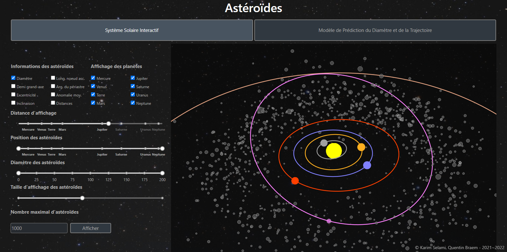
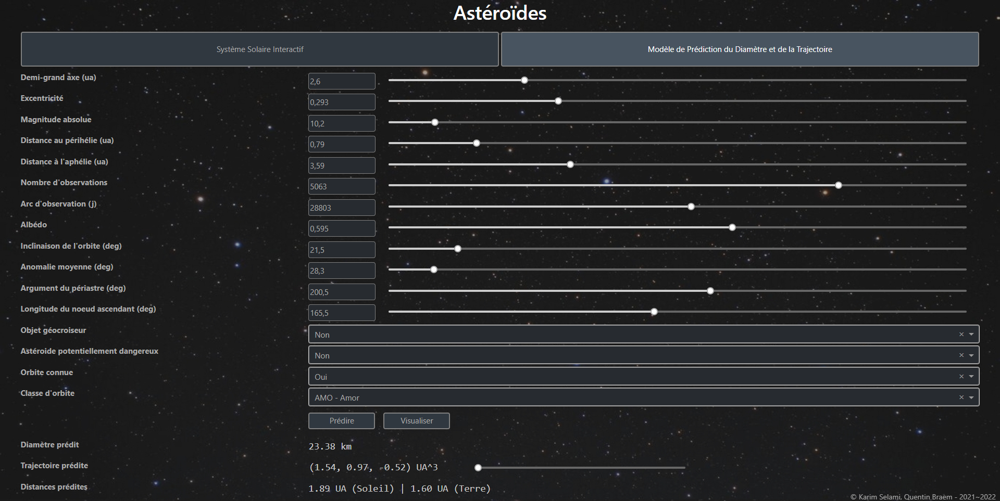

# formation-data-science-projet

*© Karim Selami, Quentin Braem - 2021~2022*

Dataset : https://www.kaggle.com/basu369victor/prediction-of-asteroid-diameter

Notebook : data_pfr_KS_QB.ipynb

Application Web : https://asteroids-335014.ew.r.appspot.com

## Description des champs de données :
https://cneos.jpl.nasa.gov/glossary/

Unité de mesure des distances : **au** = 149,597,870,700 m.

1. **semi-major axis(au)** \
https://en.wikipedia.org/wiki/Semi-major_and_semi-minor_axes \
Distance moyenne entre le point le plus éloigné (aphelion) et le plus proche (perihelion) = (aphelion distance + perihelion distance) / 2.

2. **semi-minor axis** \
https://en.wikipedia.org/wiki/Semi-major_and_semi-minor_axes \
Distance moyenne géométrique entre le point le plus éloigné (aphelion) et le plus proche (perihelion) = sqrt(aphelion distance * perihelion distance).

3. **eccentricity** \
https://en.wikipedia.org/wiki/Semi-major_and_semi-minor_axes \
sqrt(1 - (semi-minor axis)² / (semi-major axis)²).

4. **Inclination with respect to x-y ecliptic plane(deg)** \
https://en.wikipedia.org/wiki/Orbital_inclination \
Angle entre le plan-trajectoire et le plan de référence (équateur du Soleil).

5. **Longitude of the ascending node** \
https://en.wikipedia.org/wiki/Longitude_of_the_ascending_node

6. **argument of perihelion** \
https://astronomy.swin.edu.au/cosmos/A/Argument+Of+Perihelion \
L'argument du perihelion est l'angle entre l'angle ascendant et le perihelion de l'orbite.

7. **perihelion distance(au)** \
https://courses.lumenlearning.com/suny-osuniversityphysics/chapter/13-5-keplers-laws-of-planetary-motion/ \
Le perihelion est le point de la trajectoire de l'astéroide le plus proche du Soleil.

8. **aphelion distance(au)** \
https://courses.lumenlearning.com/suny-osuniversityphysics/chapter/13-5-keplers-laws-of-planetary-motion/ \
L'aphelion est le point de la trajectoire de l'astéroide le plus éloigné du Soleil.

9. **Orbital period(YEARS)** \
https://fr.wikipedia.org/wiki/Lois_de_Kepler \
3e loi de Kepler : T² = 4pi² \* a^3 / GM \
<=> T = 2pi \* sqrt(a^3 / GM)
- T = Période de révolution (en s)
- a = semi-grand axe (en m)
- GM = constante de gravitation universelle (en m3.kg−1.s−2) x masse du soleil (en kg) 

10. **data arc-span(d)** \
number of days spanned by the data-arc \
*donnée possiblement inutile*

11. **Orbit condition code** \
https://trajbrowser.arc.nasa.gov/user_guide.php
Code représentant l'incertitude entre la trajectoire calculée et la trajectoire réelle.
Plus le code est grand, plus l'incertitude est grande.

12. **Number of observation used** \
Le nombre de fois où l'astroïde a été observé. 

13. **Absolute Magnitude parameter** \
https://fr.wikipedia.org/wiki/Magnitude_apparente \
https://fr.wikipedia.org/wiki/Magnitude_absolue \
La magnitude apparente est une mesure de l'irradiance d'un objet céleste observé depuis la Terre. \
La magnitude absolue est définie comme la magnitude apparente à une unité astronomique à la fois de la Terre et du Soleil, en supposant sa face visible totalement illuminée.

14. **Near Earth Object** \
https://fr.wikipedia.org/wiki/Objet_g%C3%A9ocroiseur \
Un objet géocroiseur (ou NEO, de l'anglais Near Earth Object) est un astéroïde ou une comète du système solaire que son orbite autour du Soleil amène à faible distance de l'orbite terrestre, et donc potentiellement à proximité de la Terre.

15. **Physically Hazardous Asteroid** \
https://cneos.jpl.nasa.gov/glossary/PHA.html \
PHAs are currently defined based on parameters that measure the asteroid’s potential to make threatening close approaches to the Earth. Specifically, all asteroids with a minimum orbit intersection distance (MOID) of 0.05 au or less and an absolute magnitude (H) of 22.0 or less are considered PHAs.

16. **Diameter of asteroid(Km)** \
Diamètre moyen de l'astéroide. Peut aller de < 0.1km à > 900km.

17. **Object bi/tri axial ellipsoid dimensions(Km)** \
*Seulement 18 valeurs sur 840000 lignes, inutilisable*

18. **geometric albedo** \
L’albédo géométrique est le rapport entre la luminosité d’un corps à angle de phase zéro et la luminosité d’un disque parfaitement diffusant avec la même position et la même taille apparente que le corps. Par exemple, notre Lune a un albédo très faible (0,07), tandis que Vénus a un albédo élevé (0,60). L’albédo combiné à la magnitude absolue peut aider à déterminer la taille d’un astéroïde.

19. **Rotation Period(h)** \
https://en.wikipedia.org/wiki/Rotation_period \
Durée nécessaire à l'objet pour effectuer une rotation complète autour de son axe de rotation.

20. **Standard gravitational parameter, Product of mass and gravitational constant** \
https://fr.wikipedia.org/wiki/Param%C3%A8tre_gravitationnel_standard \
Le paramètre gravitationnel standard d'un corps, noté μ (mu), est le produit de la constante de gravitation G par la masse M de ce corps. \
Le paramètre gravitationnel standard s'exprime en km3.s−2.

21. **Color index B-V magnitude difference** \
https://fr.wikipedia.org/wiki/Indice_de_couleur \
En astronomie, l'indice de couleur d'un corps céleste (étoile, astéroïde, ...) désigne la différence entre les magnitudes apparentes de ce corps obtenues dans deux bandes spectrales différentes. La différence B-V sert à déterminer la température d'un astéroide : plus la valeur est haute, plus le corps céleste est froid.

22. **Color index U-B magnitude difference** \
Similaire à l'index B-V.

23. **Color index I-R magnitude difference** \
Similaire à l'index B-V.

24. **Spectral taxonomic type(SMASSII)** \
https://fr.wikipedia.org/wiki/Classification_spectrale_des_ast%C3%A9ro%C3%AFdes#Classification_SMASS

25. **Spectral taxonomic type(Tholen)** \
https://fr.wikipedia.org/wiki/Classification_spectrale_des_ast%C3%A9ro%C3%AFdes#Classification_SMASS

26. **Magnitude slope parameter** \
Concerne l'effet d'opposition. C'est une augmentation de la luminosité, généralement de 0,3 magnitude, observée lorsque l'objet est proche de l'opposition. Sa valeur dépend de la façon dont la lumière est diffusée par des particules à la surface de l'astéroïde. C'est connu avec précision pour seulement un petit nombre d'astéroïdes, donc pour la plupart astéroïdes une valeur de 0,15 est supposée.

27. **Earth Minimum orbit Intersection Distance(au)** \
La DMIO (en français, MOID en anglais) est définie comme la distance entre les points les plus rapprochés des orbites osculatrices des deux corps en question et est donc définie pour une date donnée et non pas selon l'évolution que ces orbites peuvent avoir dans le temps.

28. **asteroid orbit class** \
https://pdssbn.astro.umd.edu/data_other/objclass.shtml

29. **Mean motion(deg/d)** \
Le mouvement moyen (représenté par n) est la vitesse angulaire requise pour qu'un corps termine une orbite, en supposant une vitesse constante sur une orbite circulaire qui se termine en même temps que l'orbite elliptique à vitesse variable du corps réel.
C'est la vitesse moyenne angulaire de l'astéroide = 360° / période de révolution.

30. **orbital Period(d)** \
La période orbitale désigne la durée mise par un astre (étoile, planète, astéroïde) pour effectuer une orbite complète. Par exemple, la Terre a une période orbitale de 365,25 jours.

31. **Mean anomaly(deg)** \
https://fr.wikipedia.org/wiki/Anomalie_moyenne \
En mécanique céleste, l'anomalie moyenne (en anglais : mean anomaly) est une mesure d'angle entre le périapse et la position d'un corps fictif parcourant une orbite circulaire synchrone avec le corps réel. \
Anomalie moyenne = (t - t0) / T = (t - t0) * sqrt(GM / a^3), où t0 est l'instant du passage au perihelion.
C'est l'angle moyen entre la position réelle et la position que l'astéroide aurait s'il avait une orbite circulaire.
